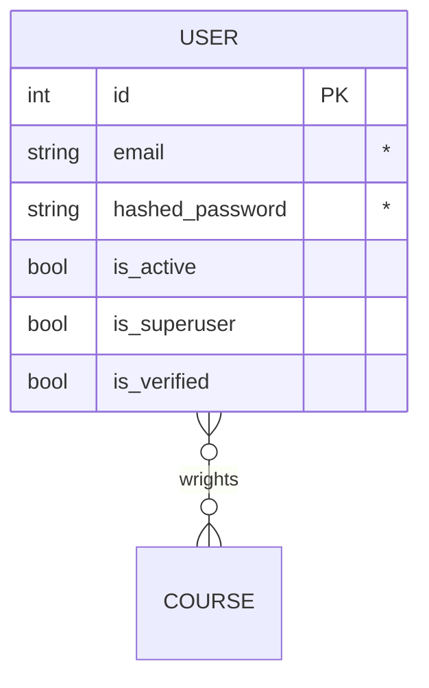

# vanga (tg bot)


## Общее описание
_____
### Краткое описание
Создание Telegram-бота для предоставления астрологических и тарологических услуг, позволяющего пользователям получать персонализированную информацию и консультации.

### Цели
1) Упрощение доступа пользователей к астрологическим и тарологическим знаниям.
2) Автоматизация проведения раскладов и расчетов.
3) Обеспечение персонализированных рекомендаций и советов.


## Техническое описание
_____
### Стек технологий:
  - Python;
  - SQLite.

### Функциональные требования
Основные функции:

1) Регистрация пользователей: Ввод имени, даты рождения и часового пояса.
2) Астрологические расклады:
  - генерация натальной карты,
  - прогнозы на основе транзитов.
3) Тарологические расклады:
  - проведение раскладов (например, "Трехкарта", "Кelta") с интерпретацией,
  - ответы на часто задаваемые вопросы по астрологии и таро.

Дополнительные функции:

1) Интерактивные переключатели для выбора интересующих тем (например, любовь, карьера).
2) Подписка на ежедневные/недельные прогнозы.
3) Возможность оставить отзыв о консультации.


### ER-Diagrams



## Сообщение описание
_____

### ???
```bash

```

## Ссылки
_____
[by Yamemik](https://github.com/Yamemik)
