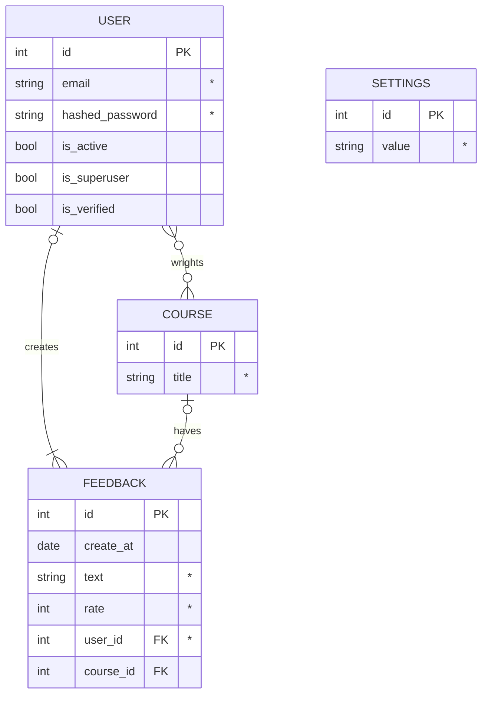

# copyright (backend)


## Общее описание
_____

### Стек технологий:
  - FastAPI;
  - postgreSQL.

## Техническое описание
_____

### ER-Diagrams



## Техническое описание
_____

### fastapi
```bash
# запустить сервер
$ uvicorn --factory src.main:create_app --reload
```

## Ссылки
_____
[by Yamemik](https://github.com/Yamemik)
