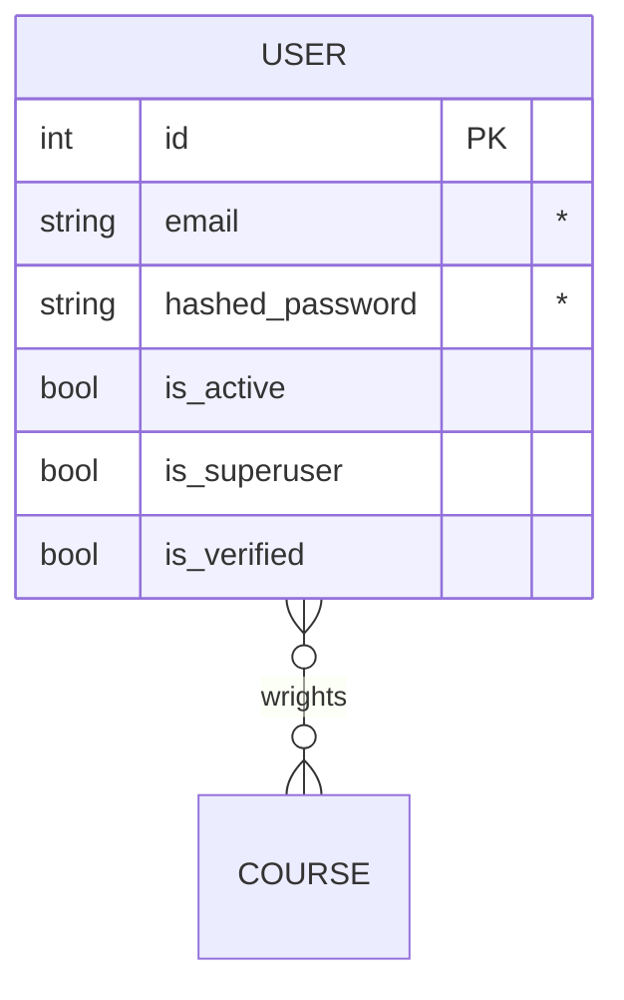

# vanga (tg bot)


## Общее описание
_____

### Стек технологий:
  - Python;
  - SQLite.

## Техническое описание
_____

### ER-Diagrams



## Техническое описание
_____

### ???
```bash

```

## Ссылки
_____
[by Yamemik](https://github.com/Yamemik)
